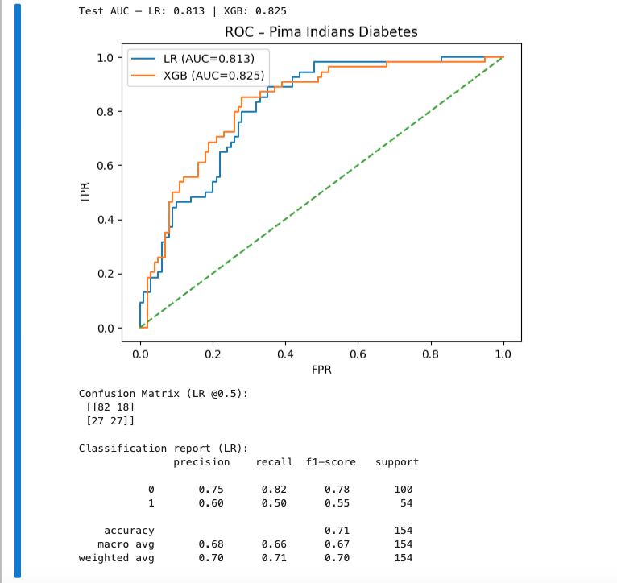
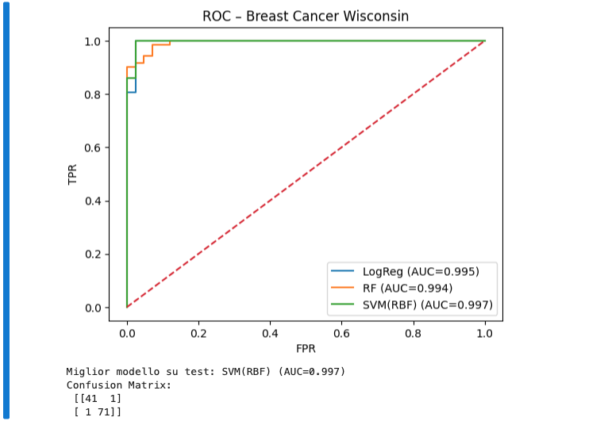
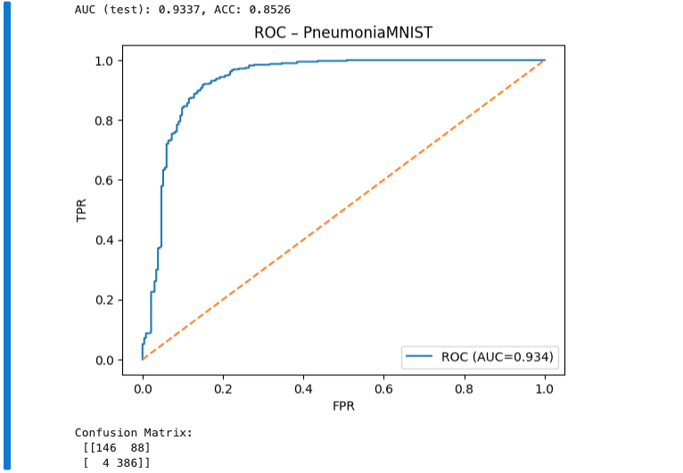

# medical-ml-demos

Repository di **notebook Python** con esempi di Machine Learning applicati alla medicina, usando dataset open.
Ogni notebook segue lo stesso flusso: **dataset → preprocessing → training → valutazione (ROC/AUC, conf. matrix)**.

## Contenuti
- `notebooks/01_xray_cnn_pneumoniamnist.ipynb` – **Classificazione immagini** (PneumoniaMNIST, da MedMNIST) con CNN PyTorch.
- `notebooks/02_diabetes_pima_classification.ipynb` – **Predizione diabete** (Pima Indians Diabetes) con modelli classici (Logistic Regression, XGBoost opzionale).
- `notebooks/03_breast_cancer_wisconsin.ipynb` – **Riconoscimento tumori** (Breast Cancer Wisconsin, scikit-learn) con confronto modelli e curva ROC multi-modello.

## Setup rapido
```bash
# Python >= 3.9
python -m venv .venv && source .venv/bin/activate  # (Windows: .venv\Scripts\activate)
pip install -r requirements.txt
jupyter lab  # o: jupyter notebook
```

> I notebook scaricano automaticamente i dataset (MedMNIST, UCI repository) se non presenti in `data/`.

## Requisiti
- GPU **non** obbligatoria (la CNN è piccola), ma supportata.
- Vedi `requirements.txt` per le versioni minime.

## Struttura
```
medical-ml-demos/
├─ notebooks/
│  ├─ 01_xray_cnn_pneumoniamnist.ipynb
│  ├─ 02_diabetes_pima_classification.ipynb
│  └─ 03_breast_cancer_wisconsin.ipynb
├─ data/               # (opzionale) cache dei dataset
├─ requirements.txt
└─ LICENSE
```

## Licenza
Codice MIT. I dataset mantengono le rispettive licenze (MedMNIST, UCI, scikit-learn datasets).

## Esempi di output

### ROC curve – Pima Indians Diabetes


---

### ROC curve – Breast Cancer Wisconsin


---

### Confusion Matrix – PneumoniaMNIST

